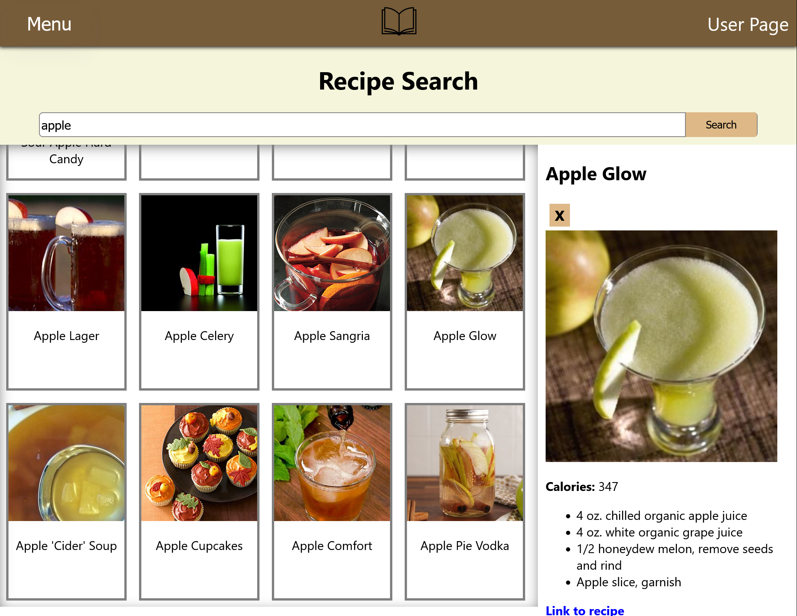

# Getting Started with Create React App

### Introduction

This is a rceipe app that allows users to search for recipe information and nutrition facts on food. On the food search page, users who are logged in can also save recipes to personal cook books, or they can save the ingredients of recipes to shopping lists where they can be checked off.

### Technologies Used

This app will make use of Mongodb, Express, React, and node in the JavaScript, Html, and CSS programming languages. In the search system, the app makes use of two seperate APIs from Edamam, their recipe API for the recipe search and their nutrition API for the nutrition search.

### Getting Started

Link to Trello Board --> trello.com/b/Rf%lrSP6/mod-3-project
This app is still a work in project and so will receive updates in the future.

### Unsolved Problems

Problems with finding data in the models folder with the .find, .equals, and .findOneAndRemove functions prevented further work on CRUD application.

### Future Enhancements

On top of user initiated deletion, future enhancements planned include multiple pages of recipes the the user can name and organize, full CRUD distribution across all data entities, and the ability for users to leave public notes on recipes in the search and private notes on recipes in the user's recipe book.
